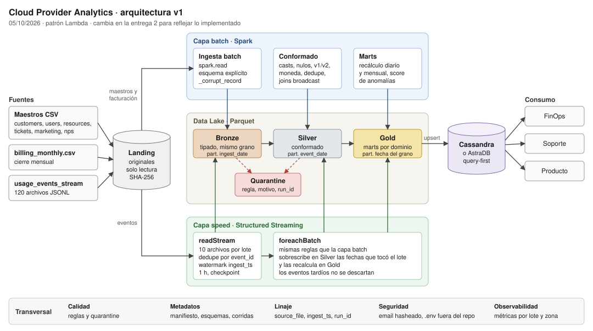

# Cloud Provider Analytics · Documento de diseño v1

Big Data (72.80) · ITBA · 2.º cuatrimestre 2026 · Prof. Diego Mosquera

Grupo 9: Nicolás Martín Amarilla Díaz, Francisco Cattaneo, Juan Manuel Rilo y Gonzalo Ruiz Camauer · versión 1.0 · 05/10/2026

Repositorio: https://github.com/gonrc/cloud-provider-analytics

Todos los números sobre los datos salen de [`notebooks/01_exploracion_landing.ipynb`](../notebooks/01_exploracion_landing.ipynb), y las tablas que genera quedan en [`evidence/01_exploracion/`](../evidence/01_exploracion/). Las decisiones tienen su registro en [`DECISIONS.md`](../DECISIONS.md).

| Punto del checklist (anexo 9.1) | Sección |
|---|---|
| Interpretación del caso y objetivos medibles | [1](#1-el-problema) |
| Análisis 5V | [2](#2-por-qué-hace-falta-big-data) |
| Inventario y perfil de fuentes | [3](#3-inventario-y-perfil-de-las-fuentes) |
| Arquitectura v1 y patrón justificado | [4](#4-arquitectura-v1) y [5](#5-patrón-lambda) |
| Matriz requisito-componente | [6](#6-matriz-requisito-componente) |
| Diseño Landing/Bronze/Silver/Gold | [7](#7-diseño-del-data-lake) |
| Flujos batch y streaming | [8](#8-flujos-batch-y-streaming) |
| Lógica MapReduce | [9](#9-flujo-batch-de-referencia-en-mapreduce) |
| Supuestos, riesgos, mitigaciones y estimación de esfuerzo | [10](#10-supuestos-riesgos-y-decisiones-abiertas) y [11](#11-estimación-de-esfuerzo-roles-y-recursos) |
| Evidencia mínima de exploración de datos | [3](#3-inventario-y-perfil-de-las-fuentes) y el notebook |

---

## 1. El problema

El área de datos de un proveedor de nube tiene que juntar lo que pasa en la plataforma (eventos de uso de cada recurso) con lo que sabe del cliente (CRM, soporte, facturación) y dejarlo listo para consultar. El dataset trae 80 organizaciones, 800 usuarios, 400 recursos en 6 servicios y 7 regiones, 60 días de eventos de uso y tres meses de facturación (junio a agosto de 2025).

Hay dos ritmos distintos. Los eventos de uso llegan todo el tiempo y el costo que generan conviene verlo en el día. Los maestros cambian poco y la facturación se cierra una vez por mes.

### Usuarios y preguntas

| Usuario | Qué decide con los datos | Preguntas | Consulta obligatoria (7.4) |
|---|---|---|---|
| FinOps | Si un cliente está gastando fuera de lo normal, cuánto factura cada organización, qué servicios pesan más | ¿Cuánto costó cada servicio por día para esta organización? ¿Qué servicios concentran el costo en las últimas dos semanas? ¿Cuánto facturó cada organización en USD después de créditos e impuestos? ¿Qué costos son anómalos? | 1, 2 y 4 |
| Soporte | Dónde reforzar la atención y qué organizaciones están en riesgo | ¿Cuántos tickets críticos entran por día? ¿Qué porcentaje incumple el SLA? ¿Cómo evoluciona el CSAT? | 3 |
| Producto | Adopción de GenAI y uso por servicio, huella de carbono | ¿Cuántos tokens de GenAI consume cada organización por día y cuánto cuestan? ¿Cuánto carbono genera cada servicio? | 5 |

### Objetivos medibles

| # | Objetivo | Métrica y meta | Se verifica en |
|---|---|---|---|
| O1 | No perder registros en silencio | Por fuente, filas en Landing = filas en Silver + filas en quarantine | Entrega 2 |
| O2 | Reprocesar sin duplicar | Re-ejecutar el pipeline completo no cambia ningún conteo; 0 `event_id` repetidos en Silver | Entrega 2. Evidencia preliminar: re-ejecutar el streaming con el mismo checkpoint no escribe filas nuevas |
| O3 | Que el costo cierre entre capas | Suma de `cost_usd_increment` válido en Silver = suma de `daily_cost_usd` en Gold, diferencia menor a 0,01 USD | Ya se cumple en el flujo de referencia de la sección 9: 148.351,58 USD en ambos lados |
| O4 | Frescura del costo diario | Un archivo que aterriza en Landing se refleja en el mart diario en menos de 5 minutos | Entrega 2 |
| O5 | Consultas servidas por Cassandra | Las 5 consultas de la sección 7.4 de la consigna se responden leyendo una sola partición y sin `ALLOW FILTERING` | Entrega final |
| O6 | Calidad visible | Cada corrida deja conteos por regla y muestras de quarantine en `evidence/` | Entrega 2 |

## 2. Por qué hace falta Big Data

Con los datos de muestra, esto no es un problema de Big Data. Son 13 MB, 43.200 eventos en 60 días, 720 por día, unos 9 por organización. Una base relacional en una sola máquina los procesa sin esfuerzo, y en la materia se discutió que usar Spark sobre datos chicos puede ser más lento que no usarlo.

Lo que justifica la arquitectura es el caso, no la muestra. Un proveedor de nube mide cada recurso de forma continua. Como supuesto de dimensionamiento: 10.000 organizaciones con la misma proporción de recursos que la muestra (5 por organización) y 3 métricas por recurso por minuto dan 216 millones de eventos por día. El diseño tiene que funcionar igual con la muestra y con ese volumen, y por eso se construye distribuido desde el principio aunque hoy corra en `local[*]`.

| V | Qué muestra el dataset | Qué implica | Decisión que genera |
|---|---|---|---|
| Volumen | 43.200 eventos; el supuesto de escala da 216 M por día. El histórico se acumula y cada reproceso vuelve a leerlo | El costo está en leer y reprocesar, no solo en guardar | Parquet columnar y particionado, Spark distribuido, retención por zona |
| Velocidad | Los eventos llegan en micro-lotes (120 archivos de 360). La facturación, una vez por mes | La velocidad de llegada y la de respuesta son cosas distintas: FinOps necesita el costo en minutos, la factura puede esperar al cierre | Streaming solo para eventos, batch para el resto. Micro-batch alcanza: la latencia que se pide es de minutos, no de milisegundos |
| Variedad | 7 CSV, 120 JSONL, una lista JSON dentro de un CSV (`tags_json`), 3 monedas | Cada formato necesita su lectura | Esquema explícito por fuente, normalización de moneda en Silver |
| Veracidad | 1.309 valores numéricos como texto, 211 costos menores a -0,01, spikes de hasta 317 USD con un p99 de 20, 40 CSAT fuera de rango, tipo de cambio distinto de 1 en todas las facturas en USD (sección 3) | Un pipeline que termina sin errores puede publicar datos malos | Reglas en cada promoción, quarantine, nada de `inferSchema` |
| Valor | Detectar un costo anómalo el mismo día y no cuando llega la factura; ver el SLA por severidad; medir adopción de GenAI | El destino es una decisión concreta de cada usuario | Gold diseñado a partir de las 5 consultas y tablas Cassandra query-first |
| Variabilidad | El esquema de eventos cambia el 18/07/2025: v2 agrega `carbon_kg` y, en genai, `genai_tokens` | El mismo flujo tiene que leer las dos versiones | Esquema unión v1+v2 en la lectura, `schema_version` conservado en Bronze |

## 3. Inventario y perfil de las fuentes

| Fuente | Filas | Grano | Clave natural | Frecuencia supuesta | Camino | Hallazgos de calidad |
|---|---|---|---|---|---|---|
| `customers_orgs.csv` | 80 | Organización | `org_id` | Diaria (maestro CRM) | Batch | `nps_score` nulo en 11; 1 fuera de -100 a 100 (101); en 25 no coinciden `plan_tier` e `is_enterprise` |
| `users.csv` | 800 | Usuario | `user_id` | Diaria | Batch | `last_login` nulo en 139; en 232 es anterior a `created_at`; `email` es dato personal |
| `resources.csv` | 400 | Recurso cloud | `resource_id` | Diaria | Batch | `tags_json` nulo en 83; 85 recursos etiquetados `pii:true` |
| `support_tickets.csv` | 1.000 | Ticket | `ticket_id` | Diaria | Batch | 240 sin `resolved_at` (abiertos); `csat` nulo en 254 y fuera de 1 a 5 en 40 (valores 0, 6 y 7) |
| `marketing_touches.csv` | 1.500 | Interacción | `touch_id` | Diaria | Batch | 96 conversiones sin click. Se toman como válidas (se puede convertir por otro camino) |
| `nps_surveys.csv` | 92 | Encuesta por organización y fecha | `org_id` + `survey_date` | Diaria | Batch | `nps_score` nulo en 19, `comment` nulo en 10. Cubre 60 de las 80 organizaciones |
| `billing_monthly.csv` | 240 | Factura por organización y mes (80 × 3) | `invoice_id` | Mensual | Batch | `credits` nulo en 137 (57%); 13 subtotales negativos; 3 monedas (USD 160, ARS 51, EUR 29); las 160 facturas en USD tienen tipo de cambio entre 0,85 y 1,12 |
| `usage_events_stream/*.jsonl` | 43.200 en 120 archivos | Evento de uso | `event_id` | Continua (micro-lotes) | Streaming | `value` nulo en 877 y como texto en 1.309; `unit` nulo en 2.075; 211 costos < -0,01; spikes (sección 7.5) |

Rangos de fecha: eventos del 03/07 al 31/08/2025; tickets del 09/05 al 31/08; marketing del 04/05 al 31/08; encuestas del 24/05 al 31/08.

Trazabilidad: la integridad referencial está completa. Todos los `org_id` de las 7 fuentes existen en `customers_orgs`, todos los `resource_id` de los eventos existen en `resources`, y el servicio de cada evento coincide con el de su recurso. Ninguna clave natural está duplicada en origen.

Evolución de esquema: el corte es limpio. Los 10.800 eventos del 03/07 al 17/07 son v1 y los 32.400 del 18/07 al 31/08 son v2. Todos los v2 traen `carbon_kg`; `genai_tokens` aparece solo en los 3.132 eventos v2 del servicio genai.

`unit` se puede completar sin adivinar porque cada métrica tiene una sola unidad: `requests` → `count`, `cpu_hours` → `hours`, `storage_gb_hours` → `gb_hours`.

### Tres trampas que aparecen al leer

Las tres se resuelven en la lectura y ninguna da error: Spark termina en verde y los datos quedan mal.

1. `value` declarado como double. Spark marca como corruptas las 1.309 filas donde el número llega entre comillas y deja `value` nulo en 2.186 filas, cuando los nulos reales son 877. Solución: leer `value` como texto y castear después con fallback, conservando el valor original (`src/cpa/casting.py`).
2. Comillas en `resources.csv`. `tags_json` escapa las comillas duplicándolas (`"[""env:prod""]"`). Con el escape por defecto de Spark, la barra invertida, 211 de las 400 filas quedan corruptas. Solución: `escape='"'`.
3. Los eventos no llegan en orden. Cada uno de los 120 archivos trae eventos de los 60 días. Con un watermark de una hora sobre la fecha del evento, la deduplicación en streaming descarta 35.972 de 43.200 eventos (83%). La decisión que sale de esto está en la sección 5 y en `DECISIONS.md` (D-06).

Distribución: el costo se concentra en compute (61.787 USD), genai (29.544) y database (22.635). Por organización, los eventos van de 99 a 1.227 con mediana 528. La organización más cargada tiene 2,3 veces la mediana, un sesgo moderado que a esta escala no afecta el shuffle.

## 4. Arquitectura v1

Diagrama v1 · 05/10/2026. Va a cambiar en la segunda entrega, cuando refleje lo implementado.



Capacidades transversales, presentes en todas las capas:

| Capacidad | Cómo se implementa |
|---|---|
| Calidad | Reglas verificables en cada promoción; lo que falla va a quarantine con la regla y el motivo |
| Metadatos | Manifiesto de Landing, esquemas en `src/cpa/schemas.py`, diccionario de datos (entrega 2), registro de cada corrida con conteos |
| Linaje | `source_file`, `ingest_ts` y `run_id` en cada fila desde Bronze; Gold guarda el `run_id` que la recalculó |
| Seguridad | `email` hasheado en Silver y ausente en Gold; recursos `pii:true` identificados; credenciales en `.env`, fuera del repo |
| Observabilidad | Métricas de cada micro-lote (`numInputRows`, filas en estado, descartes por watermark), conteos por zona y por regla en `evidence/` |

| Componente | Responsabilidad | Herramienta |
|---|---|---|
| Landing | Guardar los archivos tal como llegan y detectar si alguno cambió | Sistema de archivos, `src/cpa/landing.py` |
| Ingesta batch | Leer CSV con esquema explícito y escribir Bronze | `spark.read` |
| Ingesta streaming | Leer el directorio de eventos en micro-lotes, deduplicar y escribir Bronze | Structured Streaming |
| Procesamiento Silver | Tipos, nulos, compatibilidad v1/v2, moneda, joins con dimensiones | Spark DataFrames y Spark SQL |
| Procesamiento Gold | Marts por dominio con el grano de cada consulta | Spark |
| Analítica | Score de anomalías de costo por organización, servicio y día | Spark (z robusto; MLlib si hace falta) |
| Serving | Tablas por consulta, cargadas desde Spark | Cassandra o AstraDB (decisión abierta) |

## 5. Patrón: Lambda

| Criterio | Lambda | Kappa | Híbrido |
|---|---|---|---|
| Ajuste a las fuentes | Cada fuente va por el camino que corresponde a su ritmo | Obliga a tratar como stream una facturación mensual de 240 filas | Igual que Lambda |
| Eventos desordenados | La capa batch recalcula por día y corrige lo que llegó tarde | Para no perder datos habría que recalcular todo con re-stream, o sostener un watermark de 60 días con todo el período en estado | Depende de la combinación |
| Costo | El streaming, que es lo más caro de operar, queda limitado a los eventos | Todo corre como stream | Similar a Lambda |
| Complejidad | Dos caminos de código | Un solo camino | La más alta |

La elección es Lambda. Los maestros, la facturación, las encuestas y los tickets cambian una vez por día o por mes, y procesarlos en streaming costaría más recursos sin darle nada al usuario. Los eventos sí necesitan un camino rápido, porque FinOps quiere ver el costo del día.

El desorden de los eventos refuerza la elección. Como cada archivo trae eventos de todo el período, una agregación por fecha hecha en streaming con un watermark corto pierde la mayoría de los datos. En Lambda la capa speed no descarta nada por fecha: deduplica, escribe y recalcula los días que tocó cada micro-lote. La cifra exacta por día sale de la capa batch.

El costo de Lambda son los dos caminos de código. Se reduce haciendo que el batch y el `foreachBatch` del streaming llamen a las mismas funciones de transformación.

Structured Streaming trabaja en micro-batch y no evento por evento. Para este caso alcanza, porque la latencia que se pide es de minutos. Flink tendría sentido si hiciera falta reaccionar en milisegundos.

## 6. Matriz requisito-componente

| Requisito | Origen | V | Componente | Evidencia / entrega |
|---|---|---|---|---|
| Leer CSV/JSON de Landing con esquemas explícitos | Consigna 4.4 | Variedad | `schemas.py`, ingesta batch | Notebook 01 (hoy), Bronze (E2) |
| No modificar Landing | Consigna 3.2 | Veracidad | Landing en solo lectura + manifiesto SHA-256 | `make landing`, test `test_landing.py` (hoy) |
| Compatibilizar v1 y v2 | Consigna 3.2 | Variabilidad | Esquema unión en la lectura, `schema_version` en Bronze, reglas en Silver | Notebook 01 sección 6 (hoy), Silver (E2) |
| Castear números que llegan como texto | Consigna 3.2 | Veracidad | `cast_with_fallback` en Bronze | Notebook 01 sección 4, `test_casting.py` (hoy) |
| Streaming con watermark, dedupe por `event_id`, late data y checkpoint | Consigna 4.4 | Velocidad | Capa speed | Prueba de watermark en notebook 01 (hoy), Bronze streaming (E2) |
| Batch de maestros y facturación | Consigna 4.3 | Velocidad | Capa batch | E2 |
| Reglas de calidad y quarantine en Parquet | Consigna 4.4 | Veracidad | Reglas de promoción (sección 7.5), zona quarantine | Conteos en notebook 01 (hoy), quarantine (E2) |
| Features `daily_cost_usd`, `requests`, `cpu_hours`, `storage_gb_hours`, `genai_tokens`, `carbon_kg` | Consigna 4.4 | Valor | Gold `org_daily_usage_by_service` | Flujo de referencia (hoy), mart (E2) |
| Anomalías con método justificado | Consigna 4.4 | Veracidad, Valor | Score de anomalías | Comparación de criterios en notebook 01 (hoy), `cost_anomaly_mart` (final) |
| Marts por dominio | Consigna 7.3 | Valor | Gold | E2 (FinOps), final (resto) |
| Tablas query-first y carga desde Spark | Consigna 4.4 | Valor | Serving | E2 (1 tabla), final (5 consultas) |
| Reprocesar sin duplicados | Consigna 4.4, O2 | Veracidad | Checkpoints, claves naturales, sobrescritura de particiones, upserts en Cassandra | Re-ejecución con checkpoint en notebook 01 (hoy), conteos antes/después (E2) |
| Particionado y control de archivos | Consigna 4.4 | Volumen | Estrategia de la sección 7.3 | Conteo de archivos en notebook 01 (hoy) |
| Frescura del costo diario | O4 | Velocidad | Capa speed + `foreachBatch` | E2 |
| Gobierno: metadatos, linaje, responsables, seguridad, observabilidad | Consigna 4.4 | Veracidad | Capacidades transversales (sección 4) | E2 (preliminar), final |
| Documentación y reproducibilidad | Consigna 4.4 | Todas | README, `DECISIONS.md`, `Makefile`, `config/` | Hoy |

## 7. Diseño del Data Lake

### 7.1 Zonas

| Zona | Qué guarda | Formato | Cómo se escribe |
|---|---|---|---|
| Landing | Los archivos originales de la cátedra | CSV y JSONL, sin tocar | Se extrae una vez del zip, queda en solo lectura |
| Bronze | Las mismas filas que Landing, con tipos explícitos y columnas técnicas. Mismo grano | Parquet | Append (streaming) o sobrescritura completa por corrida (maestros) |
| Silver | Datos conformados: tipos corregidos, nulos tratados, v1 y v2 compatibles, moneda normalizada, joins con dimensiones, deduplicado por clave natural | Parquet | Sobrescritura dinámica de las particiones afectadas |
| Gold | Marts por dominio con el grano de cada consulta | Parquet, y copia en Cassandra | Recálculo de las particiones afectadas; upsert por clave primaria en Cassandra |
| Quarantine | Filas que no parsean o que fallan una regla, con la regla, el motivo y el `run_id` | Parquet | Append |

### 7.2 Rutas y nombres

```
datalake/
├── landing/                     archivos originales
├── bronze/<fuente>/             bronze/usage_events/ingest_date=2026-09-28/
├── silver/<entidad>/            silver/usage_events/event_date=2025-07-18/
├── gold/<dominio>/<mart>/       gold/finops/org_daily_usage_by_service/usage_date=2025-07-18/
├── quarantine/<fuente>/         quarantine/usage_events/run_date=2026-09-28/
└── _checkpoints/<query>/        _checkpoints/bronze_usage_events/
```

Nombres de tablas y columnas en `snake_case` y en inglés, como vienen en la fuente. Las fuentes conservan su nombre en Bronze (`billing_monthly`, `usage_events`). Los marts usan los nombres de referencia de la consigna (sección 7.3) para que la correspondencia sea directa. Las columnas técnicas empiezan sin prefijo (`ingest_ts`, `source_file`, `run_id`) y las de calidad con `dq_` (`dq_rule`, `dq_reason`).

### 7.3 Particionado

| Tabla | Partición | Por qué |
|---|---|---|
| Bronze `usage_events` | `ingest_date` | Probado en el notebook: particionar por la fecha del evento deja 3.600 archivos de 12 eventos (5 KB cada uno), porque cada micro-lote trae eventos de los 60 días y escribe en las 60 carpetas. Por fecha de ingesta quedan 60 archivos de 720 eventos. Bronze es append y se lee completo para construir Silver, así que no gana nada con la fecha del evento |
| Silver `usage_events` | `event_date` | Las consultas y los marts filtran por fecha de uso. 60 particiones de unos 720 eventos |
| Gold diarios | `usage_date` (o la fecha del grano) | Mismo filtro que las consultas de rango de fechas |
| Bronze y Silver `billing_monthly` | `month` | Es la unidad de carga: cada cierre agrega un mes |
| Maestros (`customers_orgs`, `users`, `resources`, `support_tickets`, `nps_surveys`, `marketing_touches`) | Sin partición | Entre 80 y 1.500 filas. Particionarlos solo agregaría archivos |

Servicio no se usa como segunda partición en la muestra: 60 fechas por 6 servicios darían 360 carpetas de unos 120 eventos. Con el volumen del supuesto de escala sí conviene. `spark.sql.shuffle.partitions` queda en 8 (el default de 200 deja cientos de tareas vacías después de cada shuffle con estos datos) y Silver y Gold se escriben con `repartition` por la columna de partición para tener un archivo por carpeta.

### 7.4 Columnas técnicas y metadatos

Cada fila de Bronze agrega `ingest_ts` (momento de la carga), `source_file` (el archivo de Landing del que salió, tomado de `_metadata.file_name`), `run_id` (la corrida que la escribió) e `ingest_date`. Silver conserva las tres primeras, así que desde cualquier fila de un mart se puede volver al archivo original.

Metadatos que se mantienen:

- `data/landing_manifest.csv`: los 127 archivos de Landing con tamaño y SHA-256.
- `src/cpa/schemas.py`: el esquema de cada fuente, con su clave natural.
- Registro por corrida (desde la entrega 2): filas leídas, escritas y en quarantine por tabla, en `evidence/runs/`.
- Diccionario de datos por tabla y columna (entrega 2), en `docs/`.

### 7.5 Reglas de promoción

Landing → Bronze

- La fila parsea con el esquema de su fuente. Si no, va a quarantine con el texto original (`_corrupt_record`).
- Los números que pueden llegar como texto se castean con fallback: el valor original queda en `<columna>_raw` y un flag marca si el cast falló.
- No se filtra ni se corrige nada de negocio. Bronze tiene que poder reconstruir Landing.

Bronze → Silver

- `event_id` no nulo y único. Los duplicados se resuelven quedándose con la primera ingesta.
- `cost_usd_increment >= -0.01`. Los 211 eventos por debajo van a quarantine; los que están entre -0,01 y 0 se toman como redondeo.
- `unit` no nulo cuando hay `value`. Como cada métrica tiene una sola unidad, se completa desde `metric` y se marca que fue completada.
- v1 y v2: `carbon_kg` y `genai_tokens` quedan nulos en v1, no en cero, para no confundir "no se midió" con "fue cero".
- Moneda: `amount_usd = importe × exchange_rate_to_usd`, con `credits` nulo tomado como 0. El tratamiento de las facturas en USD con tipo de cambio distinto de 1 es una decisión abierta (sección 10).
- CSAT fuera de 1 a 5 y NPS fuera de -100 a 100 pasan a nulo con un flag. La fila se conserva porque el resto de sus datos es válido.
- `users.email` se reemplaza por su hash.
- Spikes de costo: no se descartan, se marcan. Criterio preliminar: z robusto (MAD) sobre `log(1 + costo)` por servicio, mayor a 3,5. Sobre el costo sin transformar, el MAD marca 12.448 eventos (29%), porque la distribución tiene una cola derecha muy larga. Sobre el logaritmo marca 52, y el criterio "5 veces el p99" marca 75, así que los dos coinciden en el orden de magnitud. El umbral se fija en la entrega 2.

Silver → Gold

- Solo entran filas que pasaron todas las reglas.
- Control de reconciliación: la suma de costo de Silver para las fechas recalculadas tiene que coincidir con la de Gold.

### 7.6 Retención

Supuestos, porque el caso no da políticas:

| Zona | Retención | Motivo |
|---|---|---|
| Landing | Todo | Es lo único que permite reprocesar desde cero. En producción pasaría a almacenamiento frío a los 90 días |
| Bronze | 13 meses | Reprocesar Silver sin volver a Landing, con un año de comparación interanual |
| Silver | 25 meses | Dos años de historia para comparar y para calibrar el score de anomalías |
| Gold | Marts diarios 25 meses, mensuales sin límite | Lo que consultan los usuarios |
| Quarantine | 90 días | Tiempo para revisar; lo corregido se reprocesa desde Landing |
| Checkpoints | Mientras exista la query | Borrarlos hace que el stream relea todo Landing |

## 8. Flujos batch y streaming

### 8.1 Batch: maestros, tickets, encuestas y facturación

1. `make landing` extrae Landing y la verifica contra el manifiesto. Si un archivo cambió, el pipeline no sigue.
2. `spark.read.csv` con el esquema de `schemas.py`, `mode=PERMISSIVE` y `_corrupt_record`. Las filas corruptas van a quarantine.
3. Se agregan las columnas técnicas y se escribe Bronze en Parquet, sobrescribiendo la tabla (o el mes, en facturación).
4. Silver aplica las reglas de la sección 7.5 y hace los joins con dimensiones. `customers_orgs` y `resources` son chicas y van por broadcast.
5. Gold recalcula los marts: `revenue_by_org_month` desde facturación, `tickets_by_org_date` desde tickets, y los marts de uso desde Silver de eventos.
6. Carga a Cassandra desde Spark. Cassandra escribe por clave primaria, así que volver a cargar pisa la fila y no la duplica.

Frecuencia: los maestros una vez por día, la facturación al cierre de cada mes y los marts de uso una vez por día como corrección de lo que calculó la capa speed.

### 8.2 Streaming: eventos de uso

1. `spark.readStream.schema(USAGE_EVENTS).option("maxFilesPerTrigger", 10).json(...)`: 12 micro-lotes para los 120 archivos. El checkpoint registra qué archivos ya se leyeron.
2. `withColumn("ingest_ts", current_timestamp())`, `withWatermark("ingest_ts", "1 hour")` y `dropDuplicatesWithinWatermark(["event_id"])`. La deduplicación en streaming cubre el caso real de duplicado, que es el mismo archivo entregado dos veces. El estado queda acotado a una hora de llegadas.
3. Cast con fallback de `value` y escritura en Bronze, particionado por `ingest_date`.
4. `foreachBatch`: aplica las reglas de Silver al lote, sobrescribe en Silver las particiones `event_date` que tocó y recalcula esas fechas en Gold. Después hace upsert en Cassandra.
5. Los eventos tardíos no se descartan: se procesan y corrigen el día al que pertenecen. Se marca como tardío el que llega con una fecha más de una hora anterior al máximo visto, para poder medir cuántos hay.

La prueba de watermark del notebook resume por qué se hace así:

| Configuración | Filas escritas de 43.200 | Descartadas por watermark |
|---|---|---|
| Watermark de 1 hora sobre la fecha del evento | 7.228 | 35.972 |
| Watermark de 60 días sobre la fecha del evento | 43.200 | 0 (con las 43.200 claves en estado) |
| Watermark de 1 hora sobre `ingest_ts` | 43.200 | 0 |
| Lo mismo, re-ejecutado con el mismo checkpoint | 0 nuevas | 0 |

Un duplicado que llegara con más de una hora de diferencia pasaría la capa speed, y lo descarta la regla de unicidad de `event_id` en Silver.

## 9. Flujo batch de referencia en MapReduce

El caso de referencia es el mart `org_daily_usage_by_service`: costo, requests, horas de CPU, GB-hora, tokens y carbono por organización, día y servicio.

```
map(evento):
    si evento.cost_usd_increment < -0.01: descartar (va a quarantine en Silver)
    clave = (org_id, fecha(timestamp), service)
    valor = (cost_usd_increment,
             value si metric = requests,
             value si metric = cpu_hours,
             value si metric = storage_gb_hours,
             genai_tokens, carbon_kg, 1)
    emitir(clave, valor)

combine(clave, valores):          # en cada nodo, antes de mandar por la red
    emitir(clave, suma componente a componente de valores)

shuffle:                          # hash(clave) mod 8 decide el reducer
    todas las parciales de una misma clave llegan al mismo reducer

reduce(clave, parciales):
    emitir(clave, suma componente a componente de parciales)
```

El join con `customers_orgs` para sumar `plan_tier` e `industry` se hace después del reduce como join replicado: la tabla tiene 80 filas, se copia entera a cada nodo y no hace falta un segundo shuffle.

Hace falta shuffle por la pregunta de negocio. Un conteo total de eventos se resuelve con parciales por nodo y una suma final. Agrupar por organización, día y servicio obliga a juntar en un mismo lugar todos los eventos de cada clave, y eso implica mover datos.

En Spark es un `groupBy("org_id", "usage_date", "service").agg(...)` seguido de un `join(F.broadcast(customers))`. El plan físico que quedó en `evidence/01_exploracion/plan_fisico_org_daily_usage.txt` muestra la misma estructura (resumido):

```
BroadcastHashJoin LeftOuter BuildRight   ← join sin shuffle
:- HashAggregate                         ← reduce
:  +- Exchange hashpartitioning          ← shuffle
:     +- HashAggregate                   ← combine
:        +- Project / Filter             ← map
+- BroadcastExchange                     ← customers_orgs a todos los nodos
```

Resultado sobre los datos de muestra: 11.050 filas (organización × día × servicio) y 148.351,58 USD tanto en la entrada como en la salida.

Sesgo: la clave más pesada no puede tener más eventos que su organización, y la organización más cargada tiene 1.227 eventos contra una mediana de 528. Con 8 particiones de shuffle, ninguna tarea queda mucho más cargada que las demás.

## 10. Supuestos, riesgos y decisiones abiertas

### 10.1 Supuestos

| Supuesto | Por qué | Cómo se valida |
|---|---|---|
| Los timestamps de eventos están en UTC | Terminan en `Z`; la sesión de Spark fija UTC | Ya aplicado |
| `cost_usd_increment` ya está en USD | El nombre lo dice y no hay columna de moneda en los eventos | Consulta en el foro |
| `exchange_rate_to_usd` se multiplica por el importe | ARS 0,0016 da un tipo de cambio de 625 pesos por dólar, EUR entre 1,00 y 1,20 | Coherente con los valores |
| `credits` nulo significa sin créditos | El 57% de las facturas no tiene; los demás valores van de 0 a 79 | Consulta en el foro |
| Revenue = subtotal − créditos + impuestos, llevado a USD | La consigna pide "revenue con créditos e impuestos aplicados" | Consulta en el foro |
| Una conversión sin click es válida | Se puede convertir por otro canal | Sin impacto en las consultas obligatorias |
| Los tickets sin `resolved_at` están abiertos | Son 240 de 1.000 y no hay columna de estado | Se usan como abiertos en el SLA |

### 10.2 Riesgos

| Riesgo | Probabilidad | Impacto | Mitigación |
|---|---|---|---|
| El watermark descarta eventos en silencio | Alta si se usa la configuración habitual | Alto: se pierde el 83% | Watermark sobre `ingest_ts`, prueba en el notebook, conteo Landing = Silver + quarantine en cada corrida |
| Archivos chicos en Bronze y Silver | Alta | Medio: más lento de leer | Particionado de la sección 7.3, `repartition` antes de escribir, conteo de archivos como evidencia |
| Colab borra la sesión y con ella checkpoints y Data Lake | Alta | Medio | El pipeline se regenera desde el zip con un comando; opción de montar Drive para checkpoints |
| AstraDB no disponible o sin conexión el día de la demo | Media | Alto en la final | Cassandra local en Docker como alternativa; capturas y salidas guardadas en `evidence/` |
| Credenciales de AstraDB en el repo | Baja | Alto | `.env` en `.gitignore`, `.env.example` sin valores, revisión antes de cada push |
| Datos personales en Gold (`email`, recursos `pii:true`) | Media | Medio | Hash de email en Silver, Gold sin columnas personales |
| Versiones de Java y Spark distintas entre Colab y local | Media | Medio | PySpark 3.5.9 fijado; Colab trae Java 11 y local usa Java 17, las dos soportadas por Spark 3.5 |
| Cuatro personas cambiando el mismo repositorio | Media | Medio | Cada cambio en una rama y por pull request revisado por otro integrante; tests antes de mergear a `main` |

### 10.3 Decisiones abiertas

| Decisión | Opciones | Criterio | Se cierra en |
|---|---|---|---|
| Tipo de cambio en facturas USD | Aplicarlo como viene, o forzar 1 y marcarlo | Forzarlo cambia el total facturado en 108 USD sobre 164.185 (0,07%). Hay que decidir si es ruido o un ajuste | Consulta en el foro, antes de la entrega 2 |
| 13 facturas con subtotal negativo | Notas de crédito válidas, o error a quarantine | Qué representa el negativo | Consulta en el foro |
| Umbral de spikes de costo | z robusto sobre log, o percentil por servicio | No hay etiquetas de anomalía: se busca un umbral que marque pocos eventos y coincida con un criterio independiente (hoy 52 contra 75) | Entrega 2 |
| Serving en Cassandra local o AstraDB | Docker local, o AstraDB free tier | AstraDB funciona desde Colab sin instalar nada; Cassandra local no depende de la red | Entrega 2 |
| Formato de tabla | Parquet puro, o Delta Lake | Delta da `MERGE` y facilita los upserts, pero la consigna pide Parquet | Entrega 2 |
| Componente de analítica o ML | Score estadístico de anomalías, o modelo de MLlib | Si hay suficiente historia por organización y servicio para entrenar | Entrega 2 |

## 11. Estimación de esfuerzo, roles y recursos

Estimación para un equipo real, con el porcentaje de dedicación de cada rol en cada etapa. En la cursada el grupo tiene cuatro integrantes, así que cada uno cubre más de un rol; el reparto está pendiente.

| Rol | Etapa 1 · Fundación (03/08–05/10, 9 semanas) | Etapa 2 · Implementación (05/10–16/11, 6 semanas) | Etapa 3 · MVP y defensa (16/11–07/12, 3 semanas) |
|---|---|---|---|
| Líder técnico | 60% | 50% | 60% |
| Arquitecto de datos | 80% | 40% | 30% |
| Ingeniero de datos (batch y Silver) | 30% | 100% | 80% |
| Ingeniero de datos (streaming y serving) | 20% | 100% | 80% |
| Analista de datos / ML | 20% | 50% | 80% |
| Scrum Master | 20% | 20% | 20% |
| **Persona-semanas** | **20,7** | **21,6** | **10,5** |

Total: 53 persona-semanas. La etapa 1 la llevan el arquitecto y el líder técnico. En la 2 el peso pasa a los ingenieros de datos, y en la 3 vuelven a subir el líder, que prepara la defensa, y el analista, que cierra el componente de anomalías.

Recursos: Google Colab o una máquina local con Java 17 y Python 3.11; GitHub; AstraDB en su plan gratuito o Cassandra en Docker. No hay costo de infraestructura.

## 12. Repositorio

```
cloud-provider-analytics/
├── README.md              objetivo, estructura, cómo correr, estado
├── DECISIONS.md           decisiones con alternativas y consecuencias
├── Makefile               setup, landing, explore, test, clean
├── config/settings.toml   rutas y parámetros; credenciales en .env
├── data/raw/              zip del dataset de la cátedra
├── data/landing_manifest.csv
├── src/cpa/               config, sesión de Spark, esquemas, casting, Landing
├── notebooks/             01_exploracion_landing.ipynb
├── tests/                 casting y control de Landing
├── evidence/01_exploracion/
└── docs/                  este documento y el plan de correcciones
```

Convenciones: código y nombres de datos en inglés, documentación en castellano. Cada cambio va en una rama y entra a `main` por pull request revisado por otro integrante. Lo que se suba después de las 18:30 del 05/10 va en commits que empiezan con `feedback:`, como pide la regla de corte de la consigna.

## 13. Próximos pasos hacia la segunda entrega

1. Cerrar las decisiones abiertas de facturación con una consulta en el foro.
2. Bronze batch de los siete CSV y Bronze streaming de eventos con la configuración de la sección 8.2.
3. Silver de eventos y de `customers_orgs`, con las reglas de la sección 7.5 y quarantine.
4. Mart `org_daily_usage_by_service` y su tabla en Cassandra, con dos consultas CQL.
5. Registro por corrida y prueba de idempotencia con conteos antes y después.
6. Actualizar este diagrama para que muestre lo implementado.
